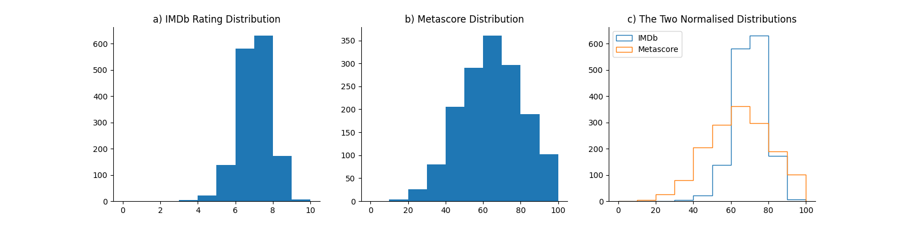

Multipage IMDb Web Scraper (inspired by Dataquest)
--------------------------------------------------

In this project, I retrieved data on the top grossing films from 1940 to 2023 listed on the [IMDb](https://www.imdb.com/) website.
On the IMDb website, users can find information about films, television shows, film cast and crew, awards, and IMDb's recommendations.
Users then can research on many aspects of media, such as release date, rating, Metascore, IMDb's rating, votes, box office numbers, and much more.

I wanted to start applying and finding out techniques on how to start retrieving data from websites - utilising requests to make HTTP requests and access data from the website, and using BeautifulSoup to parse and extract HTML and XML documents.

Additionally with the data collected, I can plot and analyse the data using matplotlib, which then insights can be found. 

Installation
------------

###
* Download and install Git: https://git-scm.com/downloads. 
* Download and install 64-bit Python 3. 
* Clone this repo to your computer.
```shell
git clone https://github.com/HanTongo/IMDbWebScraper.git
```
* Navigate to the project directory.
```shell
cd IMDBWebScraper
```
* Install the required packages 
```shell
pip install -r requirements.txt
```
  * Create a virtual environment (optional)


#### Analyse the data

* Run `python main.py`
```shell
python main.py
```
* After running `python main.py`, a **movie_ratings.csv** should be created.
* Run `python analyse.py` to display the distribution of IMDb and Metascore ratings. 
```shell
python analyse.py
```

Patterns and Insights
--------------------

#### Initial Analysis - IMDb rating, Metascore and both compared


Distribution of IMDb rating and Metascore rating, for the top grossing films from 1940 to 2023. 


**Starting with the IMDB histogram, we can see that most ratings are between 6 and 8. There are few movies with a rating greater than 8, and even fewer with a rating smaller than 4. This indicates that both very good movies and very bad movies are rarer.**

The distribution of Metascore ratings resembles a normal distribution – most ratings are average, peaking at the value of approximately 50. From this peak, the frequencies gradually decrease toward extreme rating values. According to this distribution, there are indeed fewer very good and very bad movies, but not that few as the IMDB ratings indicate.

On the comparative graph, it’s clearer that the IMDB distribution is highly skewed toward the higher part of the average ratings, while the Metascore ratings seem to have a much more balanced distribution.

What might be the reason for that skew in the IMDB distribution? One hypothesis is that many users tend to have a binary method of assessing movies. If they like the movie, they give it a 10. If they don’t like the movie, they give it a very small rating, or they don’t bother to rate the movie. This an interesting problem that’s worth being explored in more detail.**


Extending this
--------------

Any feedback and comments are greatly welcome!